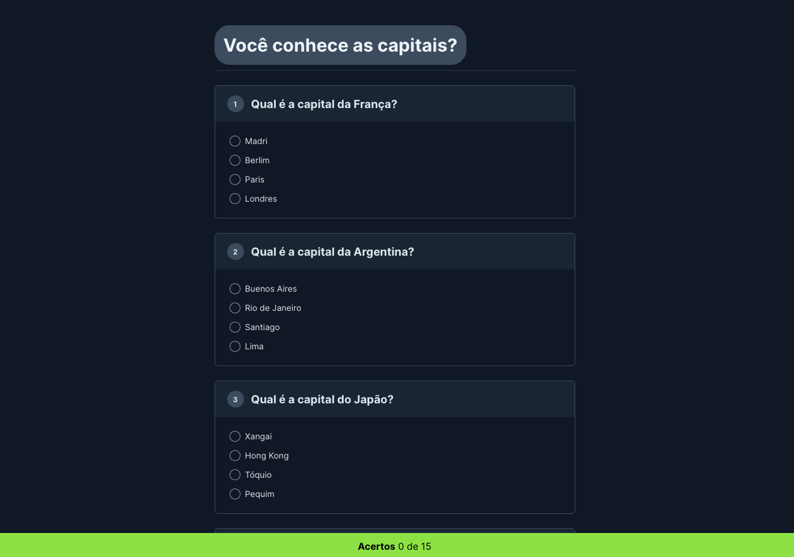

# capitals-quest

Página para teste de conhecimento sobre qual a capital de determinados países.

Aplicação desenvolvida para exercitar conhecimentos em HTML, CSS e JS.

  <a href="#-tecnologias">Tecnologias</a>&nbsp;&nbsp;&nbsp;|&nbsp;&nbsp;&nbsp;
  <a href="#-projeto">Projeto</a>&nbsp;&nbsp;&nbsp;|&nbsp;&nbsp;&nbsp;
  <a href="#memo-licença">Licença</a>

  

 

  

## 🚀 Tecnologias

Esse projeto foi desenvolvido com as seguintes tecnologias:

- HTML
- CSS
- JavaScript

## 💻 Projeto

Nesse projeto desenvolvi um quiz pra testar os conhecimentos geográficos com relação as capitais de alguns países e ter um retorno sobre a quantidade de acertos.

## 📝 Licença

Esse projeto está sob a licença MIT.